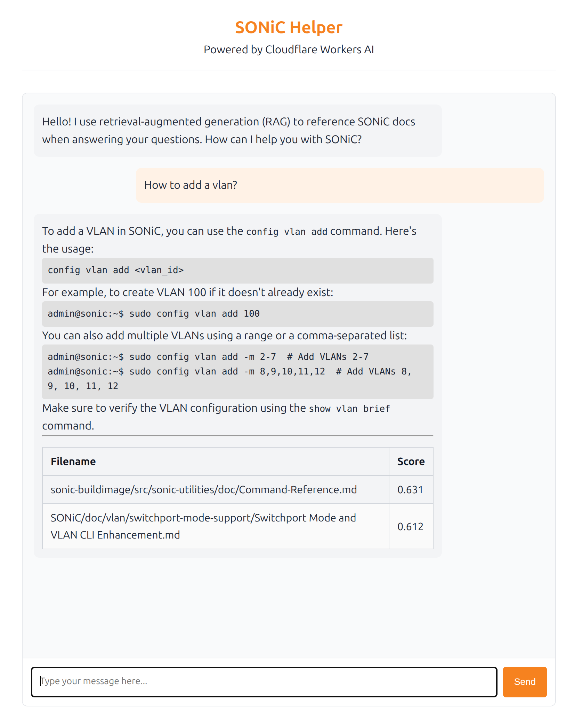
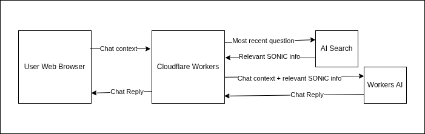

# SONiC Helper

A conversational AI chatbot for SONiC NOS (Network Operating System) queries, powered by the Cloudflare developer platform.

**Website:** https://sonic-helper.aidangallagher.workers.dev/

## Problem Statement

### Limitations of Current Tools

- **ChatGPT** performs well for general topics like Linux, but struggles with SONiC-specific queries because it lacks sufficient training data.
- **Existing docs** (SONiC documentation, internal wikis, mailing lists, etc.) contain valuable knowledge, but aren't easily searchable using natural, conversational English.

### Manual Process

* Engineers currently rely on manual searches across Confluence, GitHub, and other docs to find SONiC information.

* This often requires familiarity with SONiC terminology and where specific details are documented.


## Solution

* SONiC Chatbot provides a conversational interface for all SONiC related questions.
* Acts as a virtual assistant, remembering previous queries for context.




## Tech Stack

| Component | Description |
|-----------|-------------|
| [Cloudflare Workers](https://developers.cloudflare.com/workers/) | Serverless compute platform |
| [Hono](https://hono.dev/) | Lightweight web framework |
| [Workers AI](https://developers.cloudflare.com/workers-ai/) | LLM inference (Llama 4 Scout) |
| [R2](https://developers.cloudflare.com/r2/) | Object storage for SONiC documents |
| [AI Search](https://developers.cloudflare.com/ai-search/) | RAG pipeline (formerly AutoRAG) |

## Design

### System Design



### Control Flow

1. User types a question (e.g., "How do I configure BGP in SONiC?")
2. Browser sends `POST /api/chat` with full message history
3. AI Search finds relevant SONiC documents from the R2 bucket
4. Relevant documents are augmented into the chat conversation
5. LLM processes the augmented conversation
6. LLM response is returned to the user

### AI Search (AutoRAG)

- SONiC documents (mailing lists, internal wikis, SONiC docs, GitHub, etc.) are uploaded to an R2 bucket
- AI Search monitors the bucket and generates embeddings in a vector database
- Enables natural language search using semantic similarity
- Search results augment LLM queries with relevant context

## Project Structure

```
/
├── docs/                # Documentation assets
├── public/              # Static web assets
│   ├── index.html       # Chat UI
│   ├── chat.js          # Frontend script
│   └── icons/           # PWA icons
├── src/
│   ├── index.ts         # Worker entry point & API
│   └── types.ts         # TypeScript definitions
├── wrangler.jsonc       # Cloudflare Worker configuration
└── package.json
```

## Development

### Prerequisites

- Node.js
- Cloudflare account with Workers AI access

### Local Development

```bash
npm install
npm run dev
```

This starts a local server at http://localhost:8787.

> **Note:** Workers AI accesses your Cloudflare account even during local development, which will incur usage charges.

### Deployment

```bash
npm run deploy
```

Or push to the Git remote for CI/CD deployment.

### Scripts

| Script | Description |
|--------|-------------|
| `npm run dev` | Start local development server |
| `npm run deploy` | Deploy to Cloudflare Workers |
| `npm run check` | Type check and dry-run deploy |
| `npm test` | Run tests |

## Background

This project is a reimplementation of [SONiC Scout](https://sonicfoundation.dev/sonic-scout-enhancing-open-networking-with-ai/), an AI chatbot that won the SONiC community 2024 hackathon. SONiC Helper rebuilds the concept using the Cloudflare developer platform.

## Resources

- [Cloudflare Workers Documentation](https://developers.cloudflare.com/workers/)
- [Cloudflare Workers AI Documentation](https://developers.cloudflare.com/workers-ai/)
- [Cloudflare AI Search Documentation](https://developers.cloudflare.com/ai-search/)
- [Hono Framework](https://hono.dev/)
